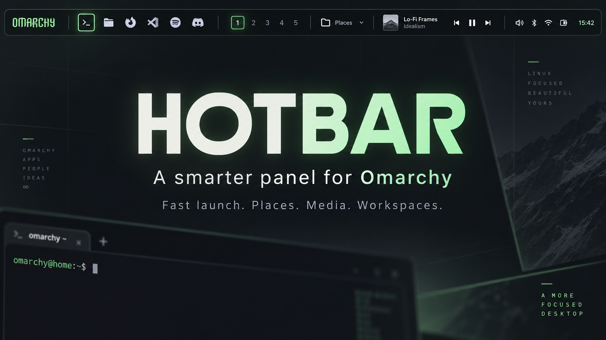
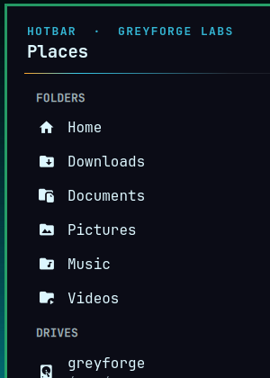
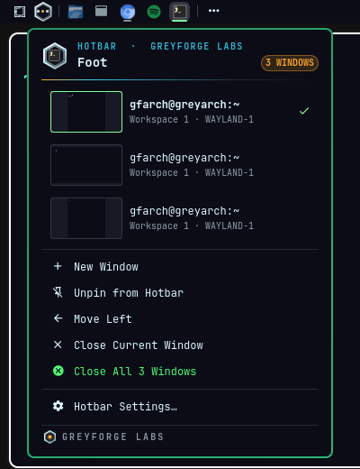
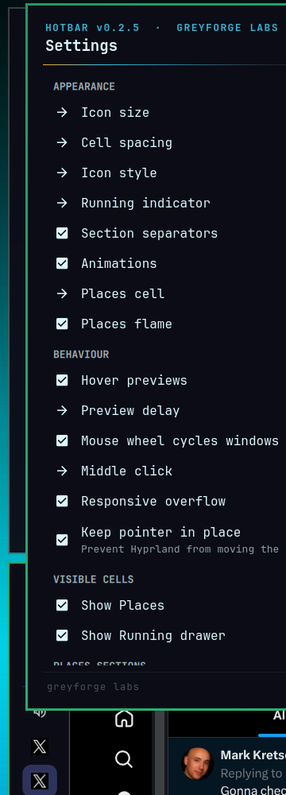

[](https://github.com/GreyforgeLabs/omarchy-hotbar/actions/workflows/test.yml)

# Hotbar

Hotbar is an Omarchy 4 bar plugin for Hyprland/Quickshell that keeps pinned apps in fixed slots and moves everything else into one Running drawer.

## Install

```bash
omarchy plugin add https://github.com/GreyforgeLabs/omarchy-hotbar.git
~/.config/omarchy/plugins/greyforge.hotbar/bin/hotbar install
```

That places Hotbar after the Omarchy menu and links the `hotbar` command into `~/.local/bin`. The installer never overwrites a file it does not own. If something looks wrong afterwards, run `hotbar doctor` first.

## What it does

The bar shows three things, always in the same order:

<p align="center">
  
</p>

**Places** — Home, XDG folders, favourites, mounted drives, Trash. One click opens any of them. Its cell is a small hot bar — a red pill with an amber bar and a flame shimmer; *Places cell → badge* in Settings spells out HOTBAR instead, and *Places flame* turns the shimmer off.

**Pinned apps** — the apps you chose, in the order you chose. One app gets one cell whether it has zero windows or twenty. Pins never reorder on their own.

**Running** — a single drawer holding every unpinned app plus any pin that does not fit. The bar never grows past its budget.

## Demo

https://github.com/user-attachments/assets/c448a696-b777-4d0d-8fa1-81cd8b216db3

Repo copy: `demo/hotbar-demo.mp4` ([blob](https://github.com/GreyforgeLabs/omarchy-hotbar/blob/master/demo/hotbar-demo.mp4) · [raw](https://github.com/GreyforgeLabs/omarchy-hotbar/raw/refs/heads/master/demo/hotbar-demo.mp4)).

<p align="center">
  
  
</p>

## Everyday controls

| Target | Left click | Middle click | Right click | Wheel | Hover |
|---|---|---|---|---|---|
| Places | open Places | open Home | open Settings | — | tooltip |
| Pinned app | launch, focus, or cycle windows | new window | app menu | cycle windows | tooltip, then previews |
| Running | open the drawer | — | open the drawer | cycle drawer windows | tooltip |

The app menu lists every window with its workspace and monitor, plus pin/unpin, move left/right, close current, and close all. Inside any popover: arrow keys or j/k to move, Enter to open, x to close the window under the cursor, Esc to dismiss.

## Settings

<p align="center">
  
</p>

Right-click Places and pick *Hotbar Settings* — appearance, behaviour, visible cells, and Places sections are all there. Changes apply immediately and are validated before they are written. Behaviour also holds **Keep pointer in place**, which stops Hyprland moving the pointer when Hotbar focuses a window (system-wide; same as `hotbar warp off`).

The CLI covers the same settings for scripting:

```bash
hotbar set iconSize 20
hotbar set iconStyle mono
hotbar get previewDelay
```

## Advanced configuration

Favourites are paths, overrides name a desktop id. Neither can carry a command:

```bash
hotbar set favorites '[{"name":"Projects","path":"~/Projects"}]'
hotbar set matches '[{"name":"Discord","matchClass":"^chrome-discord\\.com.*$","desktopId":"discord"}]'
hotbar pin chromium
hotbar unpin chromium
```

`hotbar identify` shows how every open window was grouped, which is what you need to write an override.

Pinned slots are addressable for key bindings — `omarchy-shell hotbar activateIndex 1` opens slot 1, so you can bind Super+1..9 in your Hyprland config.

## Cursor warps (pointer jumps to center)

Omarchy enables `cursor:warp_on_change_workspace` by default, and Hyprland
warps to the window center on focus. Every Hotbar click focuses a window,
so the pointer jumps. Hotbar does not change this on its own — opt in:

```bash
hotbar warp status   # disabled or enabled?
hotbar warp off      # disable (managed block in ~/.config/hypr/looknfeel.lua)
hotbar warp on       # restore Omarchy defaults
hotbar doctor        # also reports the warp state with the fix hint
```

`warp off|on` writes one marked block, backs up the file first, and runs
`hyprctl reload`. It never touches `/usr/share/omarchy/`. The same control
is in *Hotbar Settings* as **Keep pointer in place** (ON = warps disabled),
which always shows the real Hyprland state when Settings opens.

## Compatibility and safety

Needs Omarchy 4.x with Hyprland in Lua-config mode. HOTBAR has no daemon and does no background polling while idle; Places runs one short helper when it opens. A 41-window acceptance run against the live shell keeps the bar surface byte-identical before and after — see `docs/QUALIFICATION.md`.

## Removal

```bash
hotbar uninstall
```

That removes the CLI symlink it owns, the HOTBAR state mirror, and the plugin itself. Plain `omarchy plugin remove greyforge.hotbar` also removes the plugin but leaves the CLI link and state mirror behind.

## Development

```bash
bash tests/run.sh                # offline: models, lifecycle, retry, parity
tests/live/acceptance.sh         # live shell: 41-window scenario, popovers, cycling
```

Background reading: `docs/PLATFORM-AUDIT.md` (what the host provides), `docs/QUALIFICATION.md` (release-gate evidence), `CHANGELOG.md` (release history).

## More from Greyforge Labs

- [Reprieve](https://github.com/GreyforgeLabs/reprieve) — a safety net for Super+W: the window hides instead of closing, one keystroke brings it back.
- [ZJX](https://zjx.greyforge.tech) — lossless archives for structured data, with measured size and speed results.
- [Sley](https://sleylang.org) — an agent-native structural programming language for deterministic, reviewable software change.
- [ForgeVideo](https://greyforge.tech/store/forgevideo) — a governed workflow kit that turns long-form video production into reviewable packets.

## License

MIT — Greyforge Labs.
